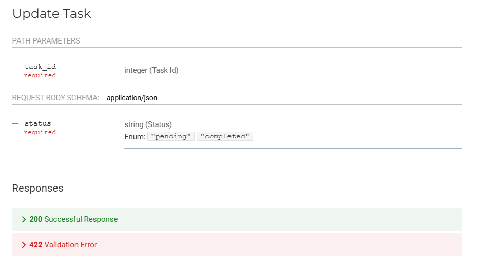

# Teste Prático - CRUD | FastAPI

## Requisitos para executar o teste prático:

| Ferramenta   | Versão Utilizada |
|--------------|------------------|
| Poetry       | 1.8.5            | 
| Python       | 3.12.8           | 

### Caso não possua alguma específica

#### Poetry

```bash
pipx install poetry
```

#### Python

```bash
pyenv update
pyenv install 3.12.8
```

## Como executar

Entre na pasta do projeto:

```bash
cd toDo_list
```

Configure a versão do Python no diretório:

```bash
pyenv local 3.12.8
```
Instale as dependências do projeto:

```bash
poetry install
```
Entre no ambiente virtual:

```bash
poetry shell
```
Inicie o servidor:

```bash
task run
```
Entre no servidor:

http://127.0.0.1:8000

## Como Testar as Requisições?

## GET

Para acessar as tarefas cadastradas, acesse http://127.0.0.1:8000/tasks

### POST

```bash
curl -X POST "http://127.0.0.1:8000/tasks" -H "Content-Type: application/json" -d '{"title": "walk with the dog", "description": "at least 1h"}'
```

### PUT

```bash
curl -X PUT "http://127.0.0.1:8000/tasks/1" -H "Content-Type: application/json" -d '{"status": "completed"}'
``` 

### DELETE

```bash
curl -X DELETE "http://127.0.0.1:8000/tasks/1"
```


## Documentação Automática do Swagger UI

### GET

<center> 


| Parâmetro    | Tipo | Obrigatório | Descrição                |
|--------------|------|-------------|--------------------------|

</center>

___

### POST

<center>


| Parâmetro    | Tipo | Obrigatório | Descrição                |
|--------------|------|-------------|--------------------------|
| title        | str  | Sim         | O título da tarefa       |
| description  | str  | Não         | A descrição da tarefa    |

</center>

___

### PUT

<center>



| Parâmetro    | Tipo | Obrigatório | Descrição                |
|--------------|------|-------------|--------------------------|
| task_id      | str  | Sim         | O ID da tarefa           |
| status       | str  | Sim         | Novo status da tarefa    |

</center>

___

### DELETE

<center>


| Parâmetro    | Tipo | Obrigatório | Descrição                |
|--------------|------|-------------|--------------------------|
| task_id      | str  | Sim         | O ID da tarefa           |

</center>